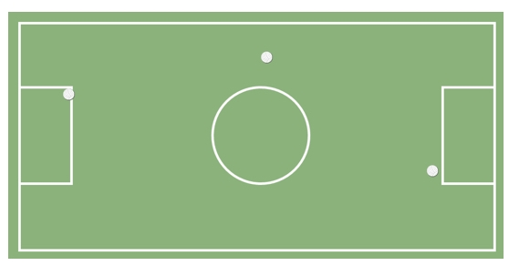

# La Cancha 

## Descripción

Se pide replicar el siguiente modelo:

A tener en cuenta:

* Se debe hacer uso de la propiedad position.

Links consultados:

[Enlace 1][1], [Enlace 2][2], [Enlace 3][3]

 [1]: https://developer.mozilla.org/es/docs/Web/CSS/color_value
 [2]: https://developer.mozilla.org/es/docs/Web/CSS/overflow
 [3]: https://franciscoamk.com/unidades-de-medida-en-css/